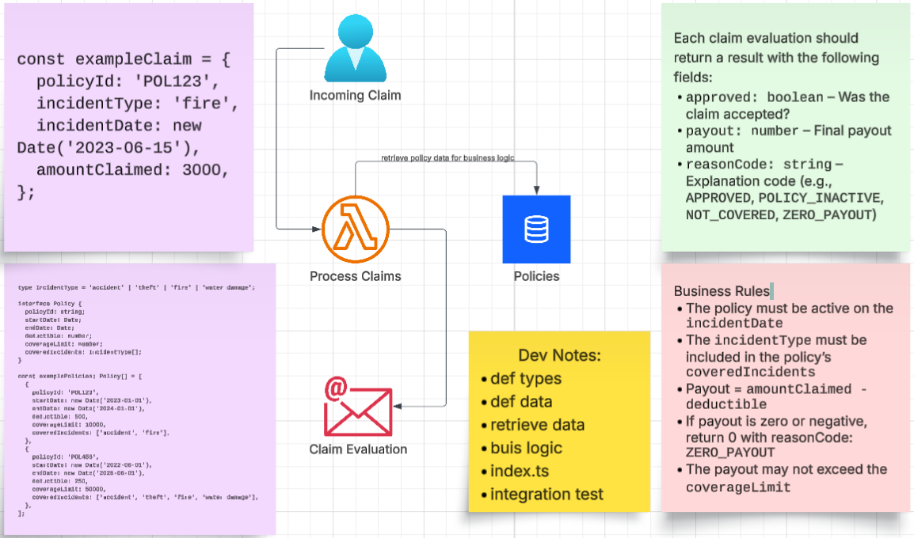

# insurance-claims

## Table of Contents
- [Overview](#overview)
- [Features](#features)
- [Installation](#installation)
- [Usage](#usage)

## Overview
Insurance Claim Evaluation System - an incoming claim is validated, matched to a policy, processed through business logic, and outputs a claim evaluation. 

## Features
- src/: Source code for the insurance claim evaluation system.
    - types/: Type definitions for claims, policies, and evaluation results.
- tests/: Unit tests and integration tests for the system.

## Installation
1. Clone the repository
2. Install dependencies using your preferred package manager (e.g., npm, yarn)
    a. npm install
3. Run the build script to compile the source code
    a. npm run build
4. Run tests to ensure everything is set up correctly
    a. npm test
5. Start the application
6. Refer to the documentation for configuration options